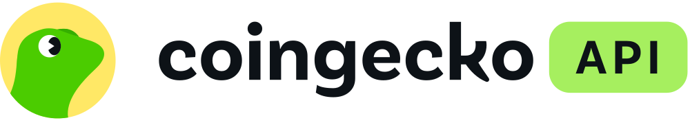

<picture>
  <source media="(prefers-color-scheme: dark)" srcset="core/brand/coingecko-api-on-dark.svg">
  
</picture>

# Trench Wallet Radar

A creator-owned wallet research terminal built using CoinGecko API data.
**Profitable doesn't always mean followable.**

## Research workflow

1. Scan active/trending tokens across a selected network.
2. Find top traders and wallets observed in recent token trades.
3. Profile wallet PnL and trade behavior.
4. Compare creator-defined Trench Score and Copyability separately.
5. Analyze cross-token wallet overlap and the filtered shortlist.
6. Inspect Recent Rotation in a wallet's Trader Dossier.
7. Review Wallet Consensus across shortlisted wallets.
8. Open tokens in Token X-Ray for deeper market inspection.

Defaults: BNB Chain (`bsc`), Trending (1h), 5 tokens, up to 20 selected wallets, a $1,000 research budget, and a five-wallet shortlist.

## Features

- **Specific Target:** search tokens, pools, tickers, contracts, or wallets; queue tokens for a targeted scan. Clearing the input clears only search results and queued targets.
- **Broader market Radar:** select network, source, token count, and budget, then Run Radar. The persistent network quick selector stays synchronized with the network filter.
- **Radar Candidates:** compare realized PnL, trade sample, recent activity, and cross-token overlap. Click a card to profile it; checkboxes select independently; token logos open Token X-Ray.
- **Wallet Analysis / Trader Dossier:** inspect separate Trench Score and Copyability metrics, PnL, holdings, trade history, wallet labels, and Recent Rotation.
- **Shortlist:** up to five eligible wallets in current filter/Trench Score order, with overlap as a tie-breaker. This is not an investment ranking.
- **Wallet Consensus:** summarize tokens touched by multiple shortlisted wallets and their latest observed buy/sell direction.
- **Token X-Ray:** token identity, market/pool context, risk fields, and interactive USD OHLCV candles with volume. Supports 1m, 5m, 15m, 1h, 4h, and 1D.
- **Wallet → token navigation:** Recent Rotation symbols or contracts use the row's network and exact contract through the same Token X-Ray flow as Radar. The dossier stays open in its original tab.

Clicking the product name performs a full page reload. The primary interface has no live trading, signing, authentication, or messaging integration. The starter's optional paper-follow, backtest, report, and autopilot code remains for compatibility, outside the primary navigation.

## Data and creator-defined logic

**CoinGecko API supplies market data, pool data, wallet trades, wallet PnL, and token/pool context.** This repository computes **Trench Score, Copyability, wallet labels, shortlist logic, rotation summaries, and Wallet Consensus**. These computed signals are **not official CoinGecko metrics**.

Trench Score is a rounded 0–100 heuristic: 40% win rate, 25% positive realized PnL (full contribution at $50,000), 20% sample size (full contribution at 20 observations), and 15% consistency (`1 - profit concentration`). Missing concentration receives a neutral component. Empty completed samples score zero; unreliable PnL is not rewarded.

Copyability remains separate: 70% trade-size affordability and 30% activity frequency for the selected budget. It does not guarantee practical execution. Changing budget clears profiles so they can be recalculated from existing data.

The `proven trader` label requires positive realized PnL, at least eight completed sold-token observations, win rate ≥55%, and known profit concentration <75%. Infrastructure and bot-like profiles are excluded from the shortlist. Labels and scores describe observed samples, not future performance.

### Sample limits

- Wallet PnL may cover multiple EVM networks; fetched trade history is network-specific. Completed observations prefer sold tokens, with matched lots as the labeled fallback.
- Recent Rotation and Consensus use the last 24 hours within up to 200 fetched trades per wallet. Full-day coverage is not guaranteed; cached profiles may be up to 30 minutes old.
- Consensus keeps networks separate and counts each wallet's latest action per token. Missing or conflicting direction suppresses the buy percentage. Empty overlap is shown honestly.
- Token X-Ray reuses the existing selected/highest-liquidity pool. It displays up to 200 real candles; no-swap intervals are not filled. Chart times are UTC, refresh is manual, and the latest candle may be incomplete. Pool close and headline token price can differ. MCAP candles are omitted without reliable circulating supply.

Research tooling, not financial advice. Overlap, profitability, and labels are not buy signals or guarantees.

## Local setup

Requires **Python 3.12+** and a CoinGecko **Analyst plan or higher** for wallet/top-trader features. Run these commands from the cloned repository root. No frontend build step is required.

PowerShell:

```powershell
python -m venv .venv
.\.venv\Scripts\python.exe -m pip install -e ".[dev]"
Copy-Item env.example .env
```

macOS/Linux:

```sh
python3 -m venv .venv
.venv/bin/python -m pip install -e ".[dev]"
cp env.example .env
```

Put your own key in the local `.env` file:

```dotenv
COINGECKO_API_KEY=your_key_here
COINGECKO_ENVIRONMENT=pro
```

`.env` must never be committed. Do not overwrite an existing `.env` when updating a checkout. The server keeps the key out of the frontend and uses `https://pro-api.coingecko.com` with the Pro API header. Without a key, the app shows setup/plan notices instead of fabricated live results.

Start on Windows:

```powershell
.\.venv\Scripts\python.exe -m uvicorn app.server:app --host 127.0.0.1 --port 8000
```

On macOS/Linux, use `.venv/bin/python` in the same command. Open [localhost:8000](http://localhost:8000/). Restart the server after changing `.env`. Local runtime outputs and caches are ignored by Git.

## Tests

Python tests (offline):

```powershell
.\.venv\Scripts\python.exe -m pytest -q
```

Frontend regression tests require Node.js; no npm installation is needed:

```sh
node tests/test_ui.cjs
node tests/test_candidates.cjs
node tests/test_consensus.cjs
node tests/test_chart.cjs
node tests/test_rotation_navigation.cjs
node tests/test_search_reset.cjs
```

Tests cover scoring, labels, scan deduplication, plan locks, rotation/consensus, OHLCV normalization, navigation, search reset, and legacy paper workflows. Live validation requires your own API key and consumes API credits.

## CoinGecko API

<!-- coingecko-links:start -->
- [CoinGecko API](https://www.coingecko.com/en/api?utm_source=x&utm_content=kafka0202)
- [CoinGecko API Pricing](https://www.coingecko.com/en/api/pricing)
- [CoinGecko API Documentation](https://docs.coingecko.com/)
- [CoinGecko Agent Skill and MCP](https://docs.coingecko.com/ai-integration)
<!-- coingecko-links:end -->

## Chart attribution

[TradingView Lightweight Charts 5.0.9](https://tradingview.github.io/lightweight-charts/) is served locally. Its Apache-2.0 license and required notice are included in `web/vendor`. Candle data comes from the [CoinGecko pool OHLCV endpoint](https://docs.coingecko.com/reference/pool-ohlcv-contract-address).
